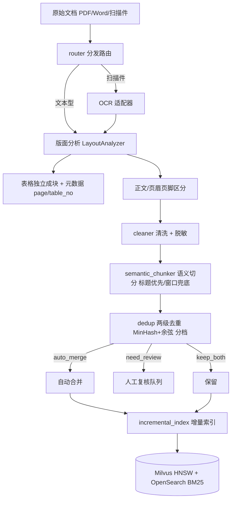
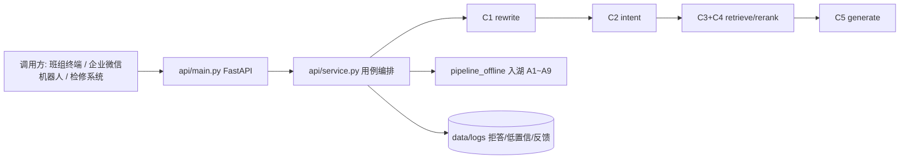

# 架构说明（thermal-power-rag 工程框架）

## 1. 设计原则

1. **业务与基础设施解耦**：所有外部依赖（LLM、向量库、BM25、OCR、rerank、意图模型）均抽象为接口；业务上层只依赖接口。每个依赖提供【真实实现（内网对接）】与【mock 实现】两套，配置切换。
2. **单机 Docker 部署对齐生产**：试点采用 Docker Compose 单机（Milvus standalone HNSW + OpenSearch BM25）；后续扩规模只需改配置，业务代码不动。
3. **双闸门防幻觉**：意图前置闸门（`intent.py`）+ 检索后置信度闸门（`rerank.py`）相互独立。
4. **置信度驱动作答**：Top-3 加权聚合 + Top1 高分兜底；阈值 ≥0.7 直接答 / 0.4~0.7 中等 / <0.4 拒答。
5. **离线去重与增量**：两级去重（MinHash + 余弦）阈值分档；增量索引用 content+version 哈希指纹，删旧 chunk。
6. **分层清晰**：`pipeline_*` 提供能力，`api/` 负责协议与用例编排，`mock_services/` 只做替身。任一层可被单独复用或替换。

## 2. 离线管线（文档入湖）



### 关键模块映射
- `router.py`：按扩展名初判；扫描件置 `need_ocr`。
- `layout_analyzer.py`：`LayoutAnalyzer` 抽象；`MockLayoutAnalyzer` 返回结构化骨架（正文/表格/页眉页脚）。
- `table_parser.py`：`TableParser` 抽象；表格独立 `TableChunk` + `page`/`table_no` 元数据。
- `cleaner.py`：去噪 + 正则脱敏（工号/手机/页码）。
- `semantic_chunker.py`：标题层级正则优先切；超长滑窗兜底。`chunk_id = {doc_key}_{文档内序号}`，**必须带文档标识**，否则多份规程页码+序号相同会在向量库撞主键（表现为「新入库的规程答不出来」）。
- `dedup.py`：`TwoStageDedup`——L0 MinHash Jaccard ≥ 阈值进 L1；L1 余弦 ≥ high 自动合并 / [medium,high) 待复核 / < medium 保留。
- `incremental_index.py`：`VectorIndexWriter` 抽象；`MockIncrementalIndexer` 维护指纹表，真实实现 `MilvusVectorIndexWriter` 双写 Milvus + OpenSearch，并在文档版本更新时按 document 清旧 chunk。

## 3. 在线管线（问答）

```mermaid
flowchart TD
    Q[用户问题] --> R[C1 rewrite 术语规范化 / HyDE开关]
    R --> I[C2 intent 意图识别]
    I -->|_DOMAIN_HINTS 前置守卫| G1{前置闸门?}
    G1 -->|否 领域外/低置信| X1[拒答 + 落盘]
    G1 -->|是| S[C3 retrieve 两路检索]
    S --> S1[dense HNSW Milvus]
    S --> S2[BM25 OpenSearch]
    S1 --> F[RRF 倒数排名融合 1/(k+rank)]
    S2 --> F
    F --> RK[C4 rerank CrossEncoder 精排]
    RK --> AG[置信度聚合 Top3加权 + Top1兜底]
    AG --> G2{置信度闸门}
    G2 -->|>=0.7| A1[直接作答 + 溯源]
    G2 -->|0.4~0.7| A2[中等置信 给答案+提示核实]
    G2 -->| <0.4| X2[拒答 + 落盘]
    A1 --> G5[C5 generate Prompt模板 + LLM抽象]
    A2 --> G5
```

### 关键模块映射
- `rewrite.py`：`_normalize_terms`（同义词/机组/故障码归一，负向预查防叠字）；`HydeGenerator` 抽象，默认关闭。
- `intent.py`：`_DOMAIN_HINTS` 全局前置守卫；`IntentModel` 抽象（`MiniLMIntentService` 真实实现 / `MockIntentModel`）；规则兜底；`log_reject` 落盘。
- `retrieve.py`：`VectorStore` / `BM25Store` 抽象；`_rrf_merge` 实现 `1/(k+rank)` 融合。
- `rerank.py`：`Reranker` 抽象（`BGERerankerService` 真实实现 / `MockReranker`）；`aggregate_confidence` 实现 Top3 加权 + Top1 兜底；`ConfidenceDecision` 三级。
- `generate.py`：`LLMClient` 抽象（`VLLMClient` 真实实现 / `MockLLM`）；`build_prompt` 含角色/幻觉抑制/溯源/强制拒答；低置信走拒答话术不调模型。

## 4. HTTP 服务层（api/）

`pipeline_*` 是能力库，要让班组真正用起来必须有一个常驻服务。该层不引入新业务逻辑，只把既有链路包装成接口。



### 分层与职责
| 文件 | 职责 | 不做什么 |
|---|---|---|
| `api/main.py` | 路由、Pydantic 校验、状态码、统一异常出口、lifespan 装配 | 不写业务逻辑 |
| `api/service.py` | 用例编排（问答/检索/入湖/反馈）、分级话术、溯源、埋点 | 不碰 HTTP 细节 |
| `api/config.py` | 配置分层加载与合并（base → mode → 环境变量） | 不解析业务参数 |
| `api/schemas.py` | 对外契约（请求/响应模型） | 不含内部 dataclass |
| `pipeline_*` | 单一能力（检索/精排/生成/切分/去重…） | 不知道 HTTP 存在 |

### 接口设计要点
- **拒答是业务返回，不是错误**：意图闸门 / 低置信拒答返回 HTTP 200 + `rejected=true` + `reject_reason`，让调用方区分「按策略拒绝」与「服务故障」。
- **`confidence` 语义统一**：指检索置信度；意图闸门拦截时未检索，故为 `0`，意图自身置信度在 `intent.confidence`，两者不混用。
- **端点用同步 `def`**：内部是阻塞式 HTTP 调用（内网模型服务），FastAPI 会自动放入线程池，不阻塞事件循环；若误用 `async def` 会卡死整个进程。
- **装配一次，请求复用**：后端实例在 lifespan 中构建并挂在 `app.state`，避免每请求重复建连接。
- **配置与镜像分离**：地址类参数一律支持 `RAG_*` 环境变量覆盖，同一镜像可在试点机、扩容集群间漂移而不重打镜像。

## 5. 抽象接口与真实落地对照

| 抽象接口 | mock（本框架） | 真实落地（内网服务） |
|---|---|---|
| `VectorStore` | `MockVectorStore` | `MilvusVectorStore`（HNSW） |
| `BM25Store` | `MockBM25` | `OpenSearchBM25` |
| `Reranker` | `MockReranker` | `BGERerankerService` → BGE-Reranker-v2-m3 |
| `LLMClient` | `MockLLM` | `VLLMClient` → vLLM（Qwen3-14B）OpenAI 兼容 |
| `IntentModel` | `MockIntentModel` | `MiniLMIntentService` → MiniLM 句向量 + 模板最近邻 |
| `LayoutAnalyzer` | `MockLayoutAnalyzer` | `LayoutAnalyzerService` → 内网版面 / OCR 服务 |
| `Embedder` | `MockEmbedder` | `EmbeddingService` → 内网 BGE-M3 |
| `VectorIndexWriter` | `MockIncrementalIndexer` | `MilvusVectorIndexWriter` → Milvus + OpenSearch 双写 |

## 6. 寻址与配置分层

同一服务在不同视角下地址不同，写错是内网部署最常见的返工原因：

| 视角 | 写法 | 例 |
|---|---|---|
| 容器内互访 | compose 服务名（Docker 内建 DNS，仅同网络可解析） | `http://milvus:19530` |
| 宿主机 / 跨机 | 宿主 IP 或内网域名 | `http://10.10.20.11:19530` |
| 本机自测 | 回环地址 | `http://127.0.0.1:19530` |

配置优先级：`configs/base.yaml` < `configs/{deployment.mode}.yaml` < `RAG_*` 环境变量。
容器编排时把地址注入环境变量，镜像本身保持环境无关。

> 所有模型服务地址在 `configs/*.yaml` 中均为占位地址，**绝不写本地模型路径或下载代码**。
